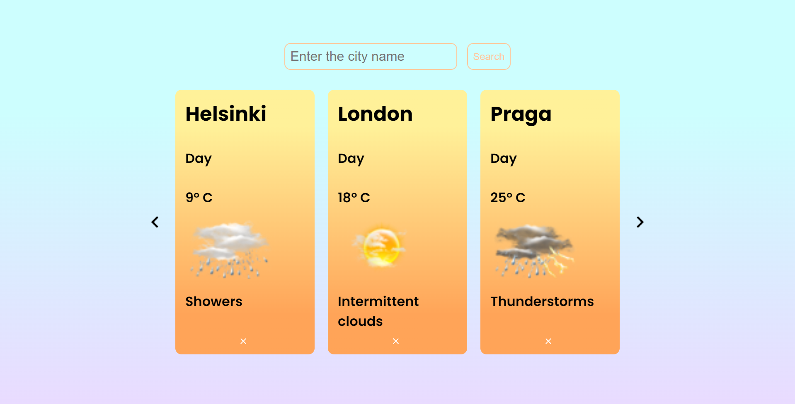

## Dmitry Sinyavskiy Weather App on ReactJS

https://city-weather-uch2ha.netlify.app

### Installation

1. Install NPM packages

```sh
  npm install
```

2. Start the application

```sh
  npm start
```

## Functionalities and Usage


-   Enter the city name to add it to the list of cities



-   You can add infinite number of cities

-   Click "close button" on the bottom the to delete city from the list

-   If you click on the card, it will turn and you will see the night weather forecast for that city


-   If you will try to add a city that is already on the list or try to add a non-existent city, you will get an error message


-   All cities are stored in browser's local storage, if you will refresh the page all not deleted cities will reappear

## Device support

-   The application also available for mobile devices

-   Tablets


-   Phones


## Warning

-   AccuWeather API has a call limit ( 50 calls/day )
-   If the app doesn't work properly, the limit may have been exceeded
